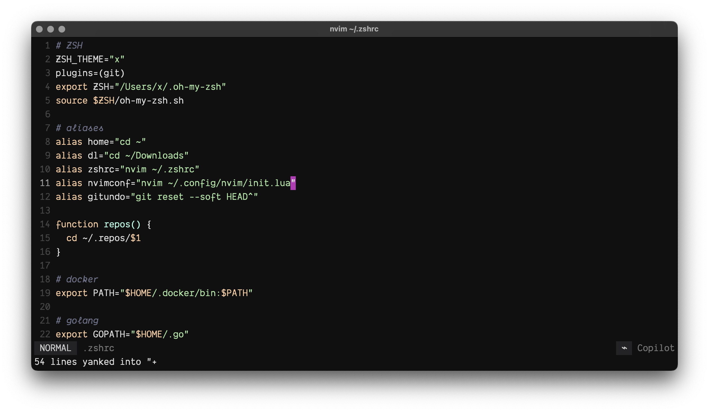

# dotfiles

Personal terminal configuration.

- neovim: [init.lua](./.config/nvim/init.lua)
- alacritty: [alacritty.yml](./.config/alacritty/alacritty.toml)
- zsh theme: [x.zsh-theme](./.oh-my-zsh/custom//themes/x.zsh-theme)
